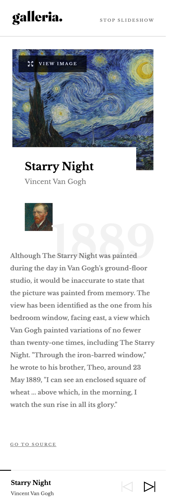
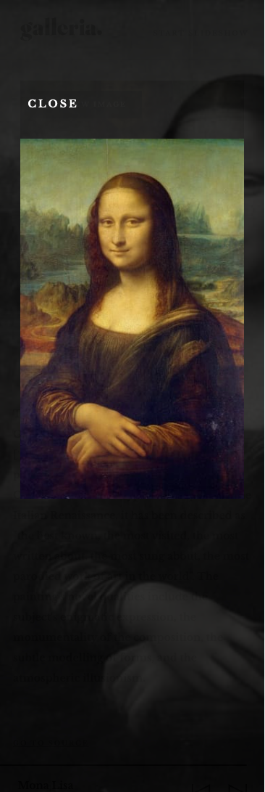
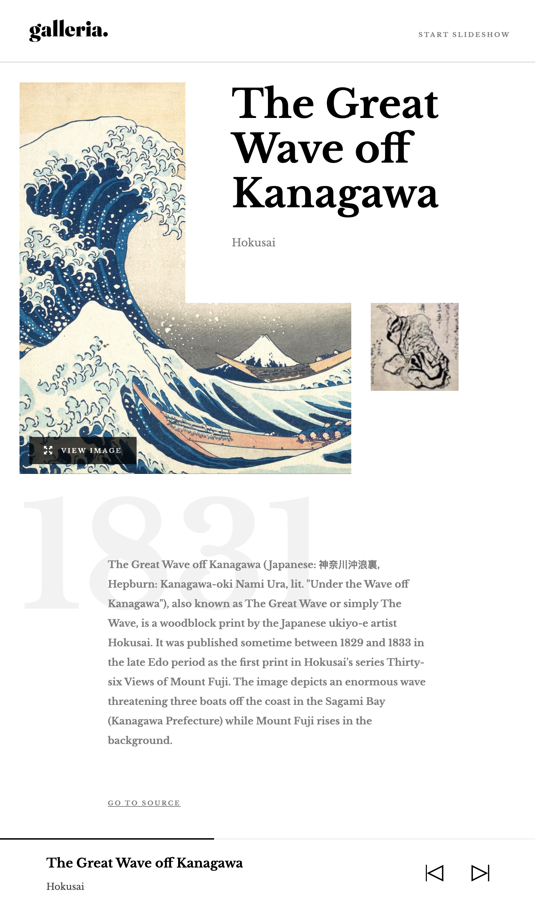
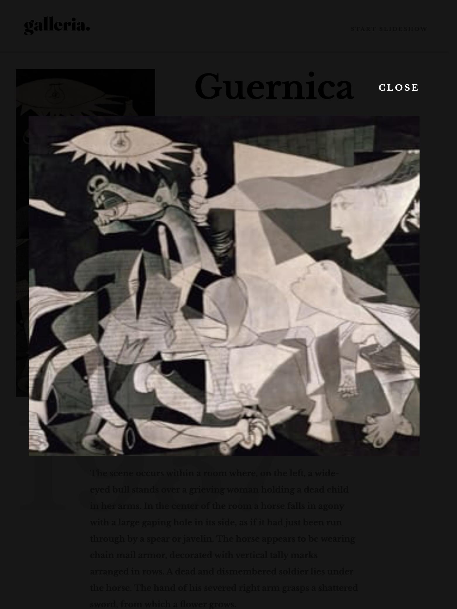
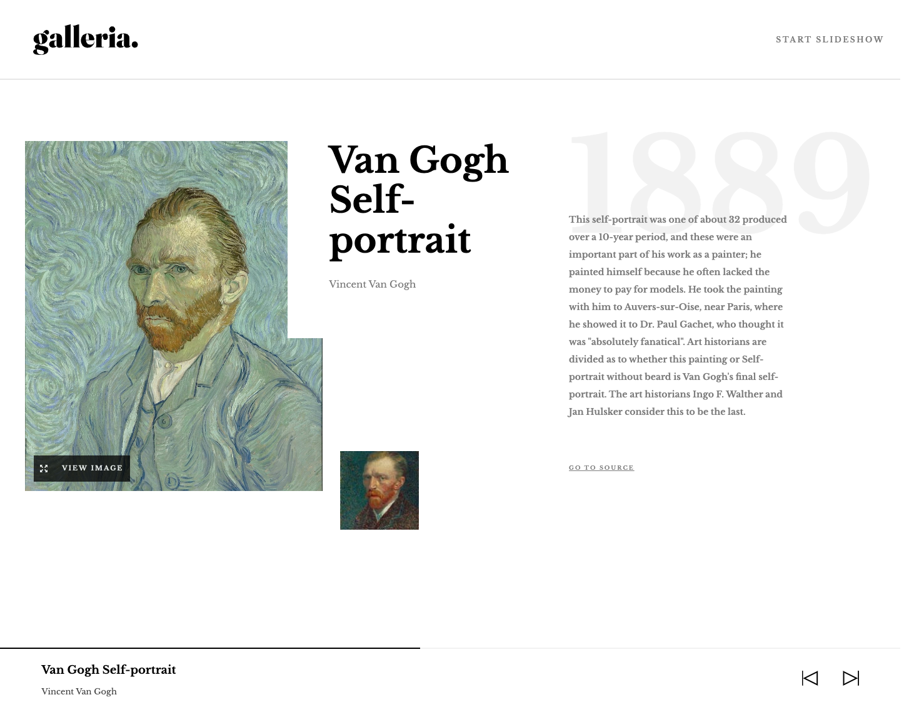
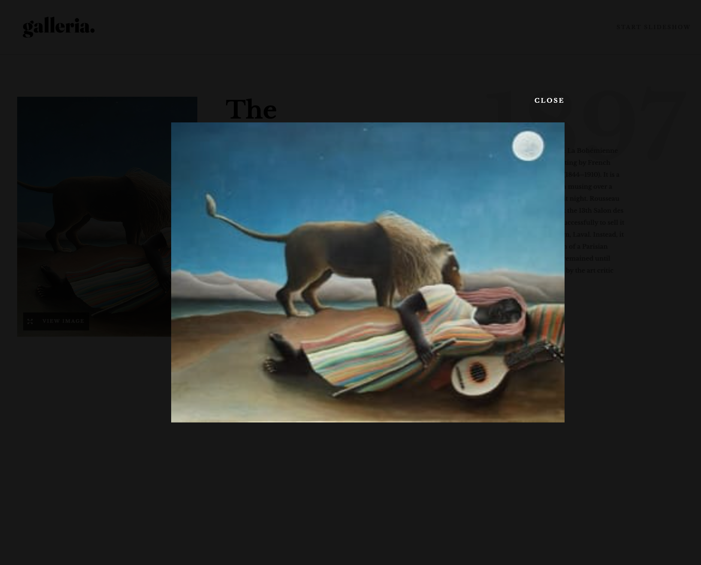

# Frontend Mentor - Galleria slideshow site solution


This is a solution to the [Galleria slideshow site challenge on Frontend Mentor](https://www.frontendmentor.io/challenges/galleria-slideshow-site-tEA4pwsa6). Frontend Mentor challenges help you improve your coding skills by building realistic projects.


## Table of contents

- [Overview](#overview)
  - [The challenge](#the-challenge)
  - [Screenshots](#screenshots)
  - [Links](#links)
- [My process](#my-process)
  - [Built with](#built-with)
  - [What I learned](#what-i-learned)
  - [Continued development](#continued-development)
  - [Useful resources](#useful-resources)
- [Author](#author)
# Overview

## The challenge

Users should be able to:
- [x] View the optimal layout for the app depending on their device's screen size
  - [x] Mobile @ <b>375px</b>
  - [x] Tablet @  <b>768px</b>
  - [x] Desktop @ <b>1440px</b>
- [x] See hover states for all interactive elements on the page
- [x] Navigate the slideshow and view each painting in a lightbox

<!-- 
- [ ]  router by slide/:id/thumbnail
- *Service
  - pause show
 -->
<!-- - [ ] TO-DO => Bugs
- Why does slide one take so long?
- start show from any slide besides index 0
- fix loader
 -->

## Screenshots


<details>
<summary><b> Mobile Screenshots @ 375px</b></summary>

-  <b>Home - Main Gallery</b>

<hr>

-  <b>Individual Slide during slideshow</b>

<hr>

-  <b>Individual Slide expanded into Lightbox</b>


</details>

<details>
<summary><b>Tablet View @ 768px </b></summary>

-  <b>Home - Main Gallery</b>

<hr>

-  <b>Individual Slide during slideshow</b>

<hr>

-  <b>Individual Slide expanded into Lightbox</b>


</details>
<details>
<summary><b>Desktop View @ 1440px</b></summary>

-  <b>Home - Main Gallery</b>

<hr>

-  <b>Individual Slide during slideshow</b>

<hr>

-  <b>Individual Slide expanded into Lightbox</b>



</details>

## Links
- Solution URL: [Click for Solution](https://github.com/Chanda-Abdul/Angular-Galleria-Slideshow)
- Live Site URL:[Click for Live Site](https://legendary-maamoul-0b4a74.netlify.app/)

## My process
- basic structure, components
- basic css
- functionality
- polish css
- fix bugs
- deploy
### Project Structure

- `/` `Home` Component
  - masonry gallery view of all available images for slideshow
- `/slide/:id` `SlideDetails` Component
  - select one image from gallery view to see slide details, but slideshow does not start
- `/slideshow` `Slideshow` Component
  - `SlideDetails` Component, starting with first slide
- `/slideshow/:id` || `/lightbox`Slideshow Component
  - `SlideDetails` Component, starting with slide `:id`

# Approach
## Built with


[](https://angular.io/) 
  - [RxJs(Reactive Extensions for JavaScript)](https://rxjs.dev/guide/overview) -  a library for composing async and event-based programs by using observable sequences(think of <b>RxJS</b> as <b>[Lodash](https://lodash.com/)</b> for events.) 
    - [Observables
]() 
  - [Routing]() 
  - [Dynamic Components](https://angular.io/guide/dynamic-component-loader) 
  - [Services](https://angular.io/guide/creating-injectable-service) 

[](https://material.angular.io/) 
  - [Image lists
](https://m2.material.io/components/image-lists#types) - display a collection of images in an organized grid. Image list was used to create the Masonry layout
  - [Progress bar](https://material.angular.io/components/progress-bar/overview) - a horizontal progress-bar for indicating progress and activity.


[](https://www.typescriptlang.org/)
[](https://www.javascript.com/)
<br>
[](https://www.figma.com/) <br>
[](https://sass-lang.com/) 
- Mobile-first workflow
- Flexbox
- CSS Grid

[ ]()<br>
[]()

## What I learned
<!-- Use this section to recap over some of your major learnings while working through this project. Writing these out and providing code samples of areas you want to highlight is a great way to reinforce your own knowledge.

 -->
 - Observables❗️
    - Observable Life Cycle🤔
    - Subject
    - Subscriptions
    - `.pipe()`
    - `.take()`
    - `.takeUntil()`
    - `.interval()`
<!-- ```js
const proudOfThisFunc = () => {
  console.log("🎉");
};
``` -->
- Masonry Layouts 🤦🏽‍♀️
  - [Angular Material Image lists
](https://m2.material.io/components/image-lists#types) - Image lists display a collection of images in an organized grid. Image list was used to create Masonry layout
- using `get()`ers
<!-- ```html
<h1>Some HTML code I'm proud of</h1>
``` -->
- [Dynamic Components]() 
<!-- ```css
.proud-of-this-css {
  color: papayawhip;
}
``` -->
- [Services]() - for cross component communication
- Routing
  - child routes
  - wildcard routes

## Continued development
### Features to Add

➕ <b> Update masonry layout</b>
- [ ] change from vertical to horizontal masonry layout, using a different library?

➕ <b> ⏸ button to pause slideshow</b>

➕ <b> Animations</b>
<!-- - [ ] Add Cool Animations -->
<!-- https://www.sliderrevolution.com/resources/css-slideshow/ -->
<!-- // On click
// Navigate to: "Desktop - Gallery 1";
// Animate: Dissolve;
animation-timing-function: linear;
animation-duration: 150ms; -->

➕ <b> Option to view/add more artwork</b>
- [ ] allow user to view more artwork by incorprating an API like [Artsy](https://developers.artsy.net/) and categories/collections selection?
<!-- fake backend?
service, get more art?
 -->
➕ <b> Infinite Scroll</b>
- [ ] after adding [Artsy (/genes)](https://developers.artsy.net/v2/docs/genes) API, add infinite scroll?  
(✨[Implementing Infinite Scrolling Using Angular](https://levelup.gitconnected.com/implementing-infinite-scrolling-using-angular-82c66f27e817))


➕ <b> Add landing page?</b>
- [ ] maybe combine this project with [Frontend Mentor - Modern Art Gallery Website Solution](https://github.com/Chanda-Abdul/Modern-Art-Gallery-Website). Create some kind of "view virtual gallery" option


## Useful resources
- [What is Observable | Observables | Angular 12+](https://youtu.be/V4iMyVnQPqM) 📽 - This is an amazing article which helped me finally understand XYZ. I'd recommend it to anyone still learning this concept.
- [Unsubscribe to an Observable | Observables | Angular 12+](https://youtu.be/8j5kvLddNwM) 📽 - This is an amazing article which helped me finally understand XYZ. I'd recommend it to anyone still learning this concept.
- [Flexbox or grid - How to decide?](https://youtu.be/3elGSZSWTbM) 📽 - This helped me for XYZ reason. I really liked this pattern and will use it going forward.
- [ Material Design Image Lists for Masonry Layout](https://material.io/components/image-lists) 💁🏽‍♀️ 🧱 - This is an amazing article which helped me finally understand XYZ. I'd recommend it to anyone still learning this concept.
- [ RxJS in Angular: Reactive Development
by Deborah Kurata ](https://www.pluralsight.com/courses/rxjs-angular-reactive-development) - This helped me for XYZ reason. I really liked this pattern and will use it going forward.
- [Learn RxJs](https://www.learnrxjs.io/) - This is an amazing article which helped me finally understand XYZ. I'd recommend it to anyone still learning this concept.
- [ Angular - The Complete Guide (2023 Edition) by Maximilian Schwarzmüller  => Dynamic Components
](https://www.udemy.com/course/the-complete-guide-to-angular-2/) - This helped me for XYZ reason. I really liked this pattern and will use it going forward.
- [Example resource 2](https://www.example.com) - This is an amazing article which helped me finally understand XYZ. I'd recommend it to anyone still learning this concept.


## Author
- Frontend Mentor - [@Chanda-Abdul](https://www.frontendmentor.io/profile/Chanda-Abdul)
- Website - [Chanda Codes](https://chandacodes.com/)
- GitHub - [github.com/Chanda-Abdul](https://github.com/Chanda-Abdul)
